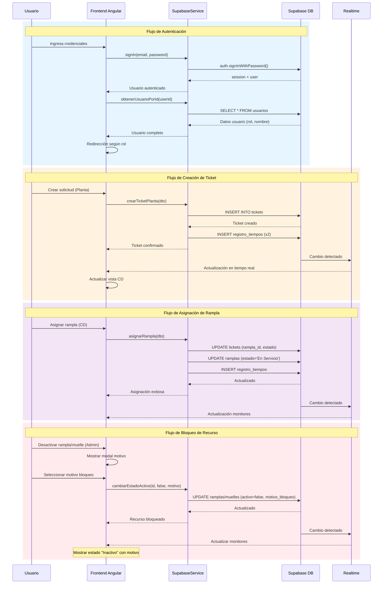
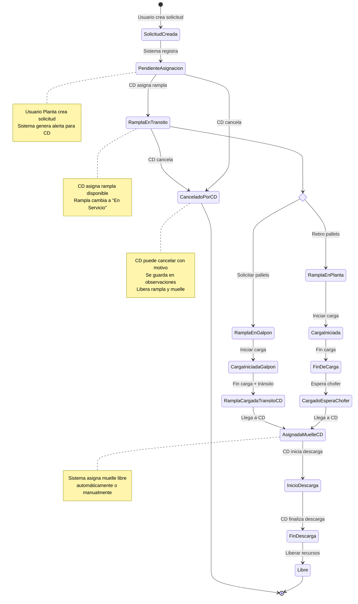

# Diagrama de Arquitectura - Sistema de Gestión de Ramplas y Muelles

## Diagrama Mermaid

```mermaid
graph TB
    subgraph "Capa de Presentación - Frontend Angular 17+"
        subgraph "Componentes de Autenticación"
            LOGIN[LoginComponent]
        end
        
        subgraph "Componentes de Administración"
            ADMIN[DashboardAdminComponent<br/>Gestión Ramplas]
            GESTION_M[GestionMuellesComponent<br/>Gestión Muelles]
        end
        
        subgraph "Componentes Rol Planta"
            PLANTA[DashboardPlantaComponent<br/>Solicitudes Retiro]
        end
        
        subgraph "Componentes Rol CD"
            CD[DashboardCdComponent<br/>Asignar Ramplas]
        end
        
        subgraph "Componentes Rol Galpón"
            GALPON[DashboardGalponComponent<br/>Solicitudes Envío]
        end
        
        subgraph "Componentes de Monitoreo"
            MON_R[MonitorRamplasComponent<br/>Vista Ramplas]
            MON_M[MonitorMuellesComponent<br/>Vista Muelles]
            DETALLE[DetalleTicketComponent<br/>Vista Detallada]
        end
        
        subgraph "Componentes Compartidos"
            NAVBAR[NavbarComponent<br/>Navegación]
            NOTIF[NotificacionesComponent<br/>Alertas]
        end
    end
    
    subgraph "Capa de Lógica de Negocio - Services"
        SUPABASE[SupabaseService<br/>- Autenticación<br/>- CRUD Tickets<br/>- CRUD Ramplas<br/>- CRUD Muelles<br/>- Realtime Subscriptions]
        NOTIFICATION[NotificationService<br/>- Gestión Alertas<br/>- Notificaciones UI]
        ALERT[AlertService<br/>- SweetAlert2<br/>- Confirmaciones]
    end
    
    subgraph "Capa de Seguridad"
        AUTH_GUARD[AuthGuard<br/>- Protección Rutas<br/>- Verificación Usuario]
    end
    
    subgraph "Capa de Modelos"
        MODELS[models.ts<br/>- Rampla<br/>- Muelle<br/>- Ticket<br/>- Usuario<br/>- RegistroTiempo<br/>- DTOs]
    end
    
    subgraph "Capa de Configuración"
        ROUTES[app.routes.ts<br/>Definición Rutas]
        ENV[environment.ts<br/>Variables Entorno]
        CONFIG[app.config.ts<br/>Configuración App]
    end
    
    subgraph "Backend - Supabase"
        subgraph "Base de Datos PostgreSQL"
            DB_USUARIOS[(Tabla: usuarios<br/>- id (UUID)<br/>- email<br/>- rol<br/>- nombre<br/>- nombre_planta)]
            DB_TICKETS[(Tabla: tickets<br/>- id<br/>- tipo_ticket<br/>- estado_actual<br/>- cantidad_pallet<br/>- muelle_planta<br/>- rampla_asignada_id<br/>- muelle_asignado_id<br/>- observaciones<br/>- motivo_bloqueo)]
            DB_RAMPLAS[(Tabla: ramplas<br/>- id<br/>- nombre<br/>- tipo_rampla<br/>- estado<br/>- activo<br/>- motivo_bloqueo<br/>- ticket_actual_id)]
            DB_MUELLES[(Tabla: muelles<br/>- id<br/>- nombre<br/>- estado<br/>- activo<br/>- motivo_bloqueo<br/>- ticket_actual_id)]
            DB_REGISTRO[(Tabla: registro_tiempos<br/>- id<br/>- ticket_id<br/>- estado_registrado<br/>- fecha_hora<br/>- usuario_id)]
        end
        
        subgraph "Funcionalidades Supabase"
            AUTH[Supabase Auth<br/>- Login/Logout<br/>- Session Management]
            RLS[Row Level Security<br/>- Políticas Acceso<br/>- Seguridad Datos]
            REALTIME[Realtime<br/>- Subscripciones<br/>- Actualizaciones Live]
            TRIGGERS[DB Triggers<br/>- limpiar_motivo_rampla<br/>- limpiar_motivo_muelle]
        end
    end
    
    %% Conexiones Frontend -> Services
    LOGIN --> SUPABASE
    ADMIN --> SUPABASE
    ADMIN --> NOTIFICATION
    ADMIN --> ALERT
    GESTION_M --> SUPABASE
    GESTION_M --> NOTIFICATION
    GESTION_M --> ALERT
    PLANTA --> SUPABASE
    PLANTA --> NOTIFICATION
    PLANTA --> ALERT
    CD --> SUPABASE
    CD --> NOTIFICATION
    CD --> ALERT
    GALPON --> SUPABASE
    GALPON --> NOTIFICATION
    MON_R --> SUPABASE
    MON_M --> SUPABASE
    DETALLE --> SUPABASE
    NAVBAR --> SUPABASE
    NOTIF --> NOTIFICATION
    
    %% Conexiones Services -> Models
    SUPABASE -.-> MODELS
    NOTIFICATION -.-> MODELS
    
    %% Conexiones Guards
    AUTH_GUARD --> SUPABASE
    ROUTES --> AUTH_GUARD
    
    %% Conexiones Config
    SUPABASE --> ENV
    CONFIG --> ROUTES
    
    %% Conexiones Backend
    SUPABASE --> AUTH
    SUPABASE --> DB_TICKETS
    SUPABASE --> DB_RAMPLAS
    SUPABASE --> DB_MUELLES
    SUPABASE --> DB_USUARIOS
    SUPABASE --> DB_REGISTRO
    SUPABASE --> REALTIME
    
    %% Seguridad
    DB_TICKETS -.-> RLS
    DB_RAMPLAS -.-> RLS
    DB_MUELLES -.-> RLS
    DB_USUARIOS -.-> RLS
    DB_REGISTRO -.-> RLS
    
    %% Triggers
    DB_RAMPLAS --> TRIGGERS
    DB_MUELLES --> TRIGGERS
    
    %% Realtime Connections
    REALTIME -.->|Updates| MON_R
    REALTIME -.->|Updates| MON_M
    REALTIME -.->|Updates| ADMIN
    REALTIME -.->|Updates| GESTION_M
    REALTIME -.->|Updates| CD
    REALTIME -.->|Updates| PLANTA
    REALTIME -.->|Updates| GALPON
    
    classDef frontend fill:#e1f5ff,stroke:#0288d1,stroke-width:2px
    classDef service fill:#fff3e0,stroke:#f57c00,stroke-width:2px
    classDef backend fill:#f3e5f5,stroke:#7b1fa2,stroke-width:2px
    classDef security fill:#ffebee,stroke:#c62828,stroke-width:2px
    classDef config fill:#e8f5e9,stroke:#388e3c,stroke-width:2px
    
    class LOGIN,ADMIN,GESTION_M,PLANTA,CD,GALPON,MON_R,MON_M,DETALLE,NAVBAR,NOTIF frontend
    class SUPABASE,NOTIFICATION,ALERT service
    class DB_USUARIOS,DB_TICKETS,DB_RAMPLAS,DB_MUELLES,DB_REGISTRO,AUTH,RLS,REALTIME,TRIGGERS backend
    class AUTH_GUARD security
    class ROUTES,ENV,CONFIG,MODELS config
```

## Vista Simplificada de Flujos Principales



## Arquitectura de Estados de Tickets


